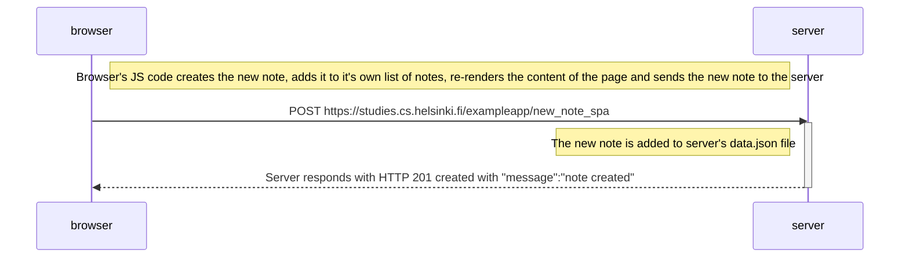

```mermaid
sequenceDiagram
    participant browser
    participant server

    Note right of browser: Browser's JS code creates the new note, adds it to it's own list of notes, re-renders the content of the page and sends the new note to the server

    browser->>server: POST https://studies.cs.helsinki.fi/exampleapp/new_note_spa
    activate server
    Note left of server: The new note is added to server's data.json file
    server-->>browser: Server responds with HTTP 201 created with "message":"note created"
    deactivate server
```
